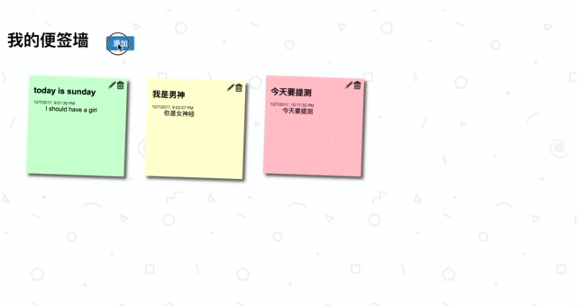

# sticker-wall
a sticker wall using [indexedDB](https://developer.mozilla.org/en-US/docs/Web/API/IndexedDB_API)

[DEMO](https://skidxjq.github.io/sticker-wall)

## keywords
```css3``` ```indexedDB``` ```drag and drop```

## screenshots
#### create a sticker



#### adjust the sequence


## Details
- all business logic are written in ```scripts/index.js``` which using Singleton desgin pattern
- you can create delete or modify the stickers
- Draging sticker A into sticker B would make a exchange on their position

## todo
- should be supported in Safari